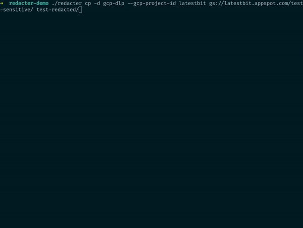

[](https://crates.io/crates/redacter)


# Redacter

Copy & Redact cli tool to securely copy and redact files removing Personal Identifiable Information (PII)
across various sources and destinations and utilizing Data Loss Prevention (DLP) capabilities.

The tool doesn't implement DLP itself, but rather relies on external models such as
Google Cloud Platform's DLP API.



## Features

* **Copy & Redact:**  copy files while applying DLP redaction to protect sensitive information.
* **Multiple Sources & Destinations:** interact with:
    * Local filesystem
    * Google Cloud Storage (GCS)
    * Amazon Simple Storage Service (S3)
    * Zip files
    * Clipboard (text content and images)
* **DLP Integration:**
    * [Google Cloud Platform DLP](https://cloud.google.com/security/products/dlp?hl=en) for accurate and customizable
      redaction for:
        * text, html, json files
        * structured data table files (csv)
        * images (jpeg, png, bpm, gif)
        * PDF files (rendering as images)
    * [Microsoft Presidio](https://microsoft.github.io/presidio/) for PII redaction (open source project that you can
      install on-prem).
        * text, html, csv, json files
        * images
        * PDF files (rendering as images)
    * [GCP Vertex AI](https://cloud.google.com/vertex-ai/docs) based redaction using any available models such as
      Gemini, Claude, etc.:
        * text, html, csv, json files
        * images that are supported by the models
        * PDF files (rendering as images)
    * [Open AI LLM](https://openai.com/) based redaction
        * text, html, csv, json files
        * images that are supported by the models
        * PDF files (rendering as images)
    * [AWS Comprehend](https://aws.amazon.com/comprehend/) PII redaction:
        * text, html, csv, json files
        * images through text extraction using OCR
        * PDF files (rendering as images from OCR)
    * ... more DLP providers can be added in the future.
* **CLI:**  Easy-to-use command-line interface for streamlined workflows.
* Built with Rust to ensure speed, safety, and reliability.

## Installation

### Binary releases

Download the latest release from [the GitHub releases](https://github.com/abdolence/redacter-rs/releases).

### Cargo

```sh
cargo install redacter
```

### Optional capabilities installation

If you are planning to use PDF redaction, OCR capabilities, please follow additional steps in
the [PDF redaction](#pdf-redaction) and [OCR](#ocr) instructions.

## Command line options

Copy and redact files from a source to a destination.

```
Usage: redacter cp [OPTIONS] <SOURCE> <DESTINATION>

Arguments:
  <SOURCE>       Source directory or file such as /tmp, /tmp/file.txt or gs://bucket/file.txt and others supported providers
  <DESTINATION>  Destination directory or file such as /tmp, /tmp/file.txt or gs://bucket/file.txt and others supported providers

Options:
  -m, --max-size-limit <MAX_SIZE_LIMIT>
          Maximum size of files to copy in bytes
  -n, --max-files-limit <MAX_FILES_LIMIT>
          Maximum number of files to copy. Sort order is not guaranteed and depends on the provider
  -f, --filename-filter <FILENAME_FILTER>
          Filter by name using glob patterns such as *.txt
  -d, --redact <REDACT>
          List of redacters to use [possible values: gcp-dlp, aws-comprehend, ms-presidio, gemini-llm, open-ai-llm, gcp-vertex-ai]
      --allow-unsupported-copies
          Allow unsupported types to be copied without redaction
      --gcp-project-id <GCP_PROJECT_ID>
          GCP project id that will be used to redact and bill API calls
      --gcp-dlp-built-in-info-type <GCP_DLP_BUILT_IN_INFO_TYPE>
          Additional GCP DLP built in info types for redaction
      --gcp-dlp-stored-info-type <GCP_DLP_STORED_INFO_TYPE>
          Additional GCP DLP user defined stored info types for redaction
      --gcp-region <GCP_REGION>
          GCP region that will be used to redact and bill API calls for Vertex AI
      --gcp-vertex-ai-native-image-support
          Vertex AI model supports image editing natively. Default is false.
      --gcp-vertex-ai-text-model <GCP_VERTEX_AI_TEXT_MODEL>
          Model name for text redaction in Vertex AI. Default is 'publishers/google/models/gemini-1.5-flash'
      --gcp-vertex-ai-image-model <GCP_VERTEX_AI_IMAGE_MODEL>
          Model name for image redaction in Vertex AI. Default is 'publishers/google/models/gemini-1.5-pro'
      --gcp-vertex-ai-block-none-harmful
          Block none harmful content threshold for Vertex AI redacter. Default is BlockOnlyHigh since BlockNone is required a special billing settings.
      --csv-headers-disable
          Disable CSV headers (if they are not present)
      --csv-delimiter <CSV_DELIMITER>
          CSV delimiter (default is ',')
      --aws-region <AWS_REGION>
          AWS region for AWS Comprehend DLP redacter
      --ms-presidio-text-analyze-url <MS_PRESIDIO_TEXT_ANALYZE_URL>
          URL for text analyze endpoint for MsPresidio redacter
      --ms-presidio-image-redact-url <MS_PRESIDIO_IMAGE_REDACT_URL>
          URL for image redact endpoint for MsPresidio redacter
      --gemini-model <GEMINI_MODEL>
          Gemini model name for Gemini LLM redacter. Default is 'models/gemini-1.5-flash'
      --sampling-size <SAMPLING_SIZE>
          Sampling size in bytes before redacting files. Disabled by default
      --open-ai-api-key <OPEN_AI_API_KEY>
          API key for OpenAI LLM redacter
      --open-ai-model <OPEN_AI_MODEL>
          Open AI model name for OpenAI LLM redacter. Default is 'gpt-4o-mini'
      --limit-dlp-requests <LIMIT_DLP_REQUESTS>
          Limit the number of DLP requests. Some DLPs has strict quotas and to avoid errors, limit the number of requests delaying them. Default is disabled
      --mime-override <MIME_OVERRIDE>
          Override media type detection using glob patterns such as 'text/plain=*.md'
  -h, --help
          Print help
```

DLP is optional and should be enabled with `--redact` (`-d`) option.
Without DLP enabled, the tool will copy all files without redaction.
With DLP enabled, the tool will redact files based on the DLP model and skip unsupported files.

## Source and destinations

Source/destination can be a local file or directory, or a file in GCS, S3, and others:

- Local file: `/tmp/file.txt` or `/tmp` for whole directory recursive copy
- GCS: `gs://bucket/file.txt` or `gs://bucket/test-dir/` for whole directory recursive copy
- S3: `s3://bucket/file.txt` or `s3://bucket/test-dir/` for whole directory recursive copy
- Zip archive: `zip://tmp/archive.zip`
- Clipboard: `clipboard://`

## DLP and redacters

### Google Cloud Platform DLP

To be able to use GCP DLP you need to:

- authenticate using `gcloud auth application-default login` or provide a service account key
  using `GOOGLE_APPLICATION_CREDENTIALS` environment variable.
- provide a GCP project id using `--gcp-project-id` option.

Additionally you can provide the list of user defined info types using `--gcp-dlp-stored-info-type` option.

### Microsoft Presidio

To be able to use Microsoft Presidio DLP you need to have a running instance of the Presidio API.
You can use Docker to run it locally or deploy it to your infrastructure.
You need to provide the URLs for text analysis and image redaction endpoints using `--ms-presidio-text-analyze-url` and
`--ms-presidio-image-redact-url` options.

### GCP Vertex AI

Vertex AI redacter supports any available models etc on GCP Vertex AI Models Garden, such as:

- Google Gemini
- Claude
- Google Imagen 3
- etc.

Default models are set to Gemini models.

To be able to use GCP Vertex AI you need to:

- authenticate using `gcloud auth application-default login` or provide a service account key
  using `GOOGLE_APPLICATION_CREDENTIALS` environment variable.
- provide a GCP project id using `--gcp-project-id` option.
- provide a GCP region using `--gcp-region` option.

You can specify different models using `--gcp-vertex-ai-text-model` and `--gcp-vertex-ai-image-model` options.
By default, they are set to:

- `publishers/google/models/gemini-1.5-flash-001` for text model
- `publishers/google/models/gemini-1.5-pro-001` for image model

In case you have access to native image editing models such as Google Imagen 3, you can enable those capabilities using
`--gcp-vertex-ai-native-image-support` option.
Without native image support, the tool will use LLM output and editing images by coordinates.

### Open AI LLM

To be able to use Open AI LLM you need to provide an API key using `--open-ai-api-key` command line option.
Optionally, you can provide a model name using `--open-ai-model` option. Default is `gpt-4o-mini`.

### AWS Comprehend

To be able to use AWS Comprehend DLP you need to authenticate using `aws configure` or provide a service account.
To provide an AWS region use `--aws-region` option since AWS Comprehend may not be available in all regions.
AWS Comprehend DLP is only available for unstructured text files.

## Multiple redacters

You can specify multiple redacters using `--redact` option multiple times.
The tool will apply redaction in the order of the redacters specified.
When multiple redacters are specified, the tool first tries to redact the file using the redacters that support input
files natively.
Only if such redacters are not available, the tool will try to redact the file using the redacters using conversions.

## PDF redaction

PDF redaction is supported by rendering PDF files as images and redacting them.
To render and convert PDF files the tool uses external library `Pdfium` (the C++ PDF library used by the Google Chromium
project).
This library needs to be installed separately on your system.

Installation instructions:

- Download the latest release from, for example,
  here [Pdfium releases](https://github.com/bblanchon/pdfium-binaries/releases) for your system.
- Extract the archive and copy library file `libpdfium.so` to the one of the following directory:
    - The path the redacter tool installed (such as `/usr/local/bin`)
    - The path that resides with redacter tool `/usr/local/lib/` if you have installed the tool in `/usr/local/bin`
    - The path with system libs like `/usr/lib/`.

If library is detected correctly it will be reported in the tool output as.
> PDF to image support: ✓ Yes

## OCR

The tool supports OCR for images and PDF files using [ocrs engine](https://github.com/robertknight/ocrs).
To enable OCR you need to download the OCR models:

- https://ocrs-models.s3-accelerate.amazonaws.com/text-detection.rten
- https://ocrs-models.s3-accelerate.amazonaws.com/text-recognition.rten

and copy those files to the `~/.cache/ocrs` directory.

## Examples:

```sh
# Copy and redact a file from local filesystem to GCS
redacter cp -d gcp-dlp --gcp-project-id <your-gcp-project-with-dlp> sensitive.png gs://my-bucket-name/test/test.png  
```

The tool supports recursive copy of multiple files from directory:

```sh
redacter cp s3://my-bucket-name/sensitive-files/ tmp/
```

Zip archives are supported too:

```sh
redacter cp gs://my-bucket-name/sensitive-files/ zip://tmp/sensitive-files.zip
```

Filter files by name:

```sh
redacter cp -f "*.jpg" ...
```

and/or by size:

```sh
redacter cp -m 1024 ...
```

MS Presidio redacter:

```sh
redacter cp -d ms-presidio --ms-presidio-text-analyze-url http://localhost:5002/analyze --ms-presidio-image-redact-url http://localhost:5003/redact ...
```

Vertex AI redacter:

```sh
redacter cp -d gcp-vertex-ai --gcp-project-id my-little-project --gcp-region europe-north1 tmp/source/ tmp/redacted/
```

Override media types based on filenames:

```sh
redacter cp --mime-override "text/plain=*.bin" ...
```

Redact an image from clipboard:

```sh
redacter cp clipboard:// tmp/image/ ...
```

## List (LS) command

For convenience, the tool also supports listing files in the source directory so you can see what files will be copied:

```
Usage: redacter ls [OPTIONS] <SOURCE>

Arguments:
  <SOURCE>  Source directory or file such as /tmp, /tmp/file.txt or gs://bucket/file.txt and others supported providers

Options:
  -m, --max-size-limit <MAX_SIZE_LIMIT>    Maximum size of files to copy in bytes
  -f, --filename-filter <FILENAME_FILTER>  Filter by name using glob patterns such as *.txt
  -h, --help                               Print help
```

Example: list files in the GCS bucket:

```sh
redacter ls gs://my-little-bucket/my-big-files/
```

## Security considerations

- Your file contents are sent to the DLP API for redaction. Make sure you trust the DLP API provider.
- The accuracy of redaction depends on the DLP model, so don't rely on it as the only security measure.
- The tool was mostly designed to redact files internally. Not recommended to use it in public environments without proper
  security measures and manual review.
- Integrity of the files is not guaranteed due to DLP implementation specifics. Some of the formats such as
  HTML/XML/JSON
  may be corrupted after redaction since they treated as text.
- Use it at your own risk. The author is not responsible for any data loss or security breaches.

## Recommended DLP providers

Google Cloud Platform DLP is recommended for accurate and customizable redaction, since it is one of the most advanced
DLP on the market.
Image redaction in LLM models right now results in not very accurate redaction, however text redaction is quite good.

For the most protection, you can use multiple DLP providers in the order of the most accurate to the least accurate.

## Licence

Apache Software License (ASL)

## Author

Abdulla Abdurakhmanov
