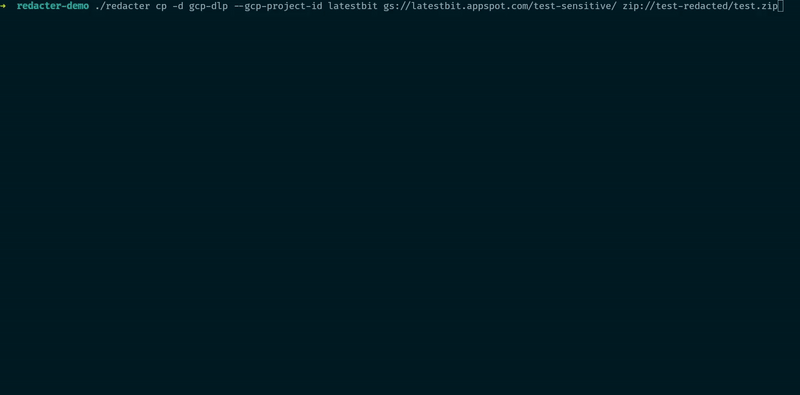

[](https://crates.io/crates/redacter)


# Redacter

Copy & Redact cli tool to securely copy and redact files removing Personal Identifiable Information (PII)
across various sources and destinations and utilizing Data Loss Prevention (DLP) capabilities.

The tool doesn't implement DLP itself, but rather relies on external models such as
Google Cloud Platform's DLP API.



## Features

* **Copy & Redact:**  copy files while applying DLP redaction to protect sensitive information.
* **Multiple Sources & Destinations:** interact with:
    * Local filesystem
    * Google Cloud Storage (GCS)
    * Amazon Simple Storage Service (S3)
    * Zip files
* **DLP Integration:**
    * [Google Cloud Platform DLP](https://cloud.google.com/security/products/dlp?hl=en) for accurate and customizable
      redaction for:
        * text, html, json files
        * structured data table files (csv)
        * images (jpeg, png, bpm, gif)
    * [AWS Comprehend](https://aws.amazon.com/comprehend/) PII redaction:
        * text, html, csv, json files
    * [Microsoft Presidio](https://microsoft.github.io/presidio/) for PII redaction (open source project that you can
      install on-prem).
        * text, html, csv, json files
        * images
    * [Gemini LLM](https://ai.google.dev/gemini-api/docs) based redaction
        * text, html, csv, json files
    * ... more DLP providers can be added in the future.
* **CLI:**  Easy-to-use command-line interface for streamlined workflows.
* Built with Rust to ensure speed, safety, and reliability.

## Installation

### Binary releases

Download the latest release from [the GitHub releases](https://github.com/abdolence/redacter-rs/releases).

### Cargo

```sh
cargo install redacter
```

## Command line options

Copy and redact files from a source to a destination.

```
Usage: redacter cp [OPTIONS] <SOURCE> <DESTINATION>

Arguments:
  <SOURCE>       Source directory or file such as /tmp, /tmp/file.txt or gs://bucket/file.txt and others supported providers
  <DESTINATION>  Destination directory or file such as /tmp, /tmp/file.txt or gs://bucket/file.txt and others supported providers

Options:
  -m, --max-size-limit <MAX_SIZE_LIMIT>
          Maximum size of files to copy in bytes
  -f, --filename-filter <FILENAME_FILTER>
          Filter by name using glob patterns such as *.txt
  -d, --redact <REDACT>
          Redacter type [possible values: gcp-dlp, aws-comprehend, ms-presidio, gemini-llm]
      --gcp-project-id <GCP_PROJECT_ID>
          GCP project id that will be used to redact and bill API calls
      --allow-unsupported-copies
          Allow unsupported types to be copied without redaction
      --csv-headers-disable
          Disable CSV headers (if they are not present)
      --csv-delimiter <CSV_DELIMITER>
          CSV delimiter (default is ','
      --aws-region <AWS_REGION>
          AWS region for AWS Comprehend DLP redacter
      --ms-presidio-text-analyze-url <MS_PRESIDIO_TEXT_ANALYZE_URL>
          URL for text analyze endpoint for MsPresidio redacter
      --ms-presidio-image-redact-url <MS_PRESIDIO_IMAGE_REDACT_URL>
          URL for image redact endpoint for MsPresidio redacter
      --gemini-model <GEMINI_MODEL>
          Gemini model name for Gemini LLM redacter. Default is 'models/gemini-1.5-flash'
  -h, --help
          Print help
```

DLP is optional and should be enabled with `--redact` (`-d`) option.
Without DLP enabled, the tool will copy all files without redaction.
With DLP enabled, the tool will redact files based on the DLP model and skip unsupported files.

Source/destination can be a local file or directory, or a file in GCS, S3, or a zip archive:

- Local file: `/tmp/file.txt` or `/tmp` for whole directory recursive copy
- GCS: `gs://bucket/file.txt` or `gs://bucket/test-dir/` for whole directory recursive copy
- S3: `s3://bucket/file.txt` or `s3://bucket/test-dir/` for whole directory recursive copy
- Zip archive: `zip://tmp/archive.zip`

## DLP redacters

### Google Cloud Platform DLP

To be able to use GCP DLP you need to:

- authenticate using `gcloud auth application-default login` or provide a service account key
  using `GOOGLE_APPLICATION_CREDENTIALS` environment variable.
- provide a GCP project id using `--gcp-project-id` option.

### AWS Comprehend

To be able to use AWS Comprehend DLP you need to authenticate using `aws configure` or provide a service account.
To provide an AWS region use `--aws-region` option since AWS Comprehend may not be available in all regions.
AWS Comprehend DLP is only available for unstructured text files.

### Microsoft Presidio

To be able to use Microsoft Presidio DLP you need to have a running instance of the Presidio API.
You can use Docker to run it locally or deploy it to your infrastructure.
You need to provide the URLs for text analysis and image redaction endpoints using `--ms-presidio-text-analyze-url` and
`--ms-presidio-image-redact-url` options.

### Gemini LLM

To be able to use GCP DLP you need to:

- authenticate using `gcloud auth application-default login --client-id-file=<client_secret-file>.json` or provide a
  service account key
  using `GOOGLE_APPLICATION_CREDENTIALS` environment variable.
  Please note that you need to also configure OAuth setup following the
  official [instructions](https://ai.google.dev/gemini-api/docs/oauth#set-cloud).
- provide a GCP project id using `--gcp-project-id` option.

## Examples:

```sh
# Copy and redact a file from local filesystem to GCS
redacter cp -d gcp-dlp --gcp-project-id <your-gcp-project-with-dlp> sensitive.png gs://my-bucket-name/test/test.png  
```

The tool supports recursive copy of multiple files from directory:

```sh
redacter cp s3://my-bucket-name/sensitive-files/ tmp/
```

Zip archives are supported too:

```sh
redacter cp gs://my-bucket-name/sensitive-files/ zip://tmp/sensitive-files.zip
```

Filter files by name:

```sh
redacter cp -f "*.jpg" ...
```

and/or by size:

```sh
redacter cp -m 1024 ...
```

MS Presidio redacter:

```sh
redacter cp -d ms-presidio --ms-presidio-text-analyze-url http://localhost:5002/analyze --ms-presidio-image-redact-url http://localhost:5003/redact ...
```

## List (LS) command

For convenience, the tool also supports listing files in the source directory so you can see what files will be copied:

```
Usage: redacter ls [OPTIONS] <SOURCE>

Arguments:
  <SOURCE>  Source directory or file such as /tmp, /tmp/file.txt or gs://bucket/file.txt and others supported providers

Options:
  -m, --max-size-limit <MAX_SIZE_LIMIT>    Maximum size of files to copy in bytes
  -f, --filename-filter <FILENAME_FILTER>  Filter by name using glob patterns such as *.txt
  -h, --help                               Print help
```

Example: list files in the GCS bucket:

```sh
redacter ls gs://my-little-bucket/my-big-files/
```

## Security considerations

- Your file contents are sent to the DLP API for redaction. Make sure you trust the DLP API provider.
- The accuracy of redaction depends on the DLP model, so don't rely on it as the only security measure.
- The tool was mostly design to redact files internally. Not recommended use it in public environments without proper
  security measures and manual review.
- Integrity of the files is not guaranteed due to DLP implementation specifics. Some of the formats such as
  HTML/XML/JSON
  may be corrupted after redaction since they treated as text.
- Use it at your own risk. The author is not responsible for any data loss or security breaches.

## Licence

Apache Software License (ASL)

## Author

Abdulla Abdurakhmanov
